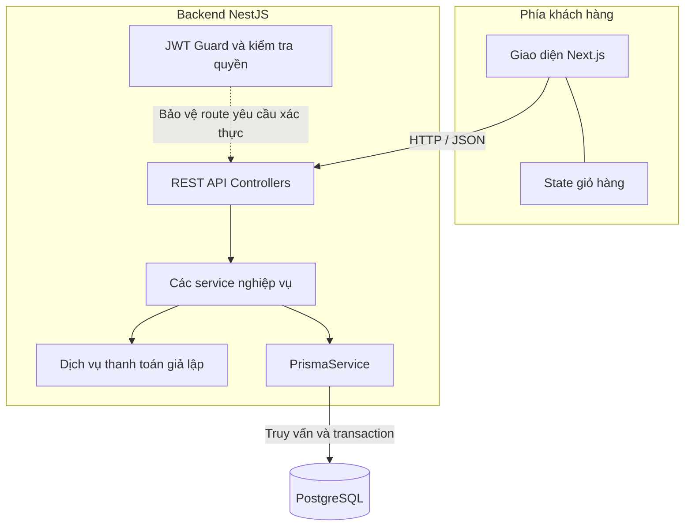

# Kiến trúc hệ thống BrewLite

**Bước:** 8 — Architecture  
**Ngày cập nhật:** 05/10/2026  
**Trạng thái:** Bản thiết kế để nhóm review trước khi triển khai.  
**Vị trí trong repository:** `docs/ARCHITECTURE.md`

## 1. Mục tiêu và phạm vi

Tài liệu chốt cách tổ chức frontend, backend và database của BrewLite, trách nhiệm từng module và cách phối hợp giữa các thành viên. Kiến trúc sử dụng Next.js, NestJS và PostgreSQL; dự kiến tích hợp Prisma.

Phạm vi bám đề bài BrewLite, SRS, User Story, Acceptance Criteria và Business Rules của nhóm. Quy trình 24 bước được thực hiện đầy đủ; các yêu cầu Scrum, review và kiểm thử được duy trì xuyên suốt. Chi tiết bảng dữ liệu và hợp đồng API sẽ được cụ thể hóa ở các bước tiếp theo.

Kiến trúc phục vụ ứng dụng đặt đồ uống, chọn size/topping,
quản lý giỏ hàng, đăng nhập, tạo đơn, thanh toán giả lập,
theo dõi đơn, quản lý tồn kho, khuyến mãi và điểm thưởng.

Hệ thống hỗ trợ các thao tác xử lý đơn của nhân viên qua API
có kiểm tra quyền. Giao diện nhân viên đầy đủ là phần mở rộng.

Không triển khai thanh toán thật hoặc giao hàng.

Tài liệu mô tả kiến trúc dự kiến. Các thành phần được nêu
không đồng nghĩa đã được triển khai đầy đủ.

## 2. Kiểu kiến trúc và công nghệ

BrewLite sử dụng một frontend Next.js và một backend NestJS.
Backend được chia thành các module theo nghiệp vụ và chạy
trong cùng một ứng dụng. Cách tổ chức này gọi là modular monolith.

Mã nguồn frontend và backend được quản lý trong cùng repository,
lần lượt tại thư mục `frontend/` và `backend/`.

| Thành phần | Công nghệ | Trách nhiệm |
| --- | --- | --- |
| Frontend | Next.js, React, TypeScript, Tailwind CSS | Hiển thị giao diện, quản lý giỏ hàng và gọi API |
| Backend | NestJS, TypeScript | Xác thực, phân quyền, kiểm tra dữ liệu và xử lý nghiệp vụ |
| Truy cập dữ liệu | Prisma, dự kiến tích hợp | Truy vấn database, hỗ trợ transaction và quản lý migration |
| Database | PostgreSQL | Lưu trữ dữ liệu của hệ thống |
| Thanh toán giả lập | Module trong backend | Mô phỏng kết quả thanh toán, không thu tiền thật |

Frontend giao tiếp với backend qua REST API, sử dụng JSON
cho dữ liệu nghiệp vụ.

Theo thiết kế, backend truy cập PostgreSQL thông qua Prisma.
Frontend không kết nối trực tiếp đến database.

Dịch vụ thanh toán giả lập nằm trong backend,
không triển khai thành một hệ thống bên ngoài.

## 3. Sơ đồ kiến trúc tổng quan



### Cách đọc sơ đồ

- Người dùng thao tác trên giao diện Next.js.
- Giỏ hàng được quản lý ở frontend và lưu trên trình duyệt
  theo yêu cầu đã chốt.
- Frontend gửi yêu cầu đến REST API của NestJS.
- Các API cần bảo vệ phải kiểm tra JWT và quyền truy cập.
  API công khai như xem menu không bắt buộc đăng nhập.
- Controller chuyển yêu cầu hợp lệ đến service nghiệp vụ.
- Các service xử lý sản phẩm, khuyến mãi, đơn hàng, tồn kho,
  thanh toán và điểm thưởng.
- Thanh toán được mô phỏng bên trong backend.
- Backend sử dụng PrismaService để đọc/ghi PostgreSQL.
- Kết quả được trả về frontend để cập nhật giao diện.

Sơ đồ thể hiện quan hệ giữa các thành phần, không mô tả
thứ tự thực thi chi tiết của NestJS. Guard được thực thi
trước controller handler trên các route được bảo vệ.

### Nguyên tắc dữ liệu

Frontend có thể tính giá để hiển thị, nhưng backend phải
kiểm tra lại sản phẩm, tùy chọn, khuyến mãi và tồn kho,
sau đó tính số tiền chính thức.

Frontend không được tự quyết định trạng thái thanh toán,
số điểm thưởng, tồn kho hoặc quyền của người dùng.

DATABASE_URL và thông tin bí mật chỉ được sử dụng phía backend,
không đưa vào mã frontend hoặc biến NEXT_PUBLIC_.

## 4. Các module và trách nhiệm

Phân công được đồng bộ ngày 10/10/2026 theo `docs/TEAM_ASSIGNMENTS.md`. Hưng chủ trì tổng thể các bước 1–6, 8, 22, Scrum và bàn giao; các chủ module trực tiếp thực hiện phần được giao và cung cấp minh chứng. Cập nhật phân công không thay đổi thiết kế kỹ thuật hoặc trạng thái triển khai.

### 4.1. Backend

Các module được tổ chức theo nghiệp vụ, đặt tại
`backend/src/<module>/`, thống nhất với cấu trúc hiện tại
của repository.

| Module | Trách nhiệm | Phụ trách |
| --- | --- | --- |
| products | Cung cấp menu, chi tiết sản phẩm, size và topping | Hưng |
| auth | Đăng ký, đăng nhập, phát JWT và xác thực yêu cầu | Khoa |
| users | Quản lý thông tin tài khoản và quyền người dùng | Khoa |
| loyalty | Đọc điểm, ghi nhận cộng điểm và đảo điểm | Huy |
| promotions | Kiểm tra mã khuyến mãi và tính mức giảm | Huy |
| orders | Tạo, đọc, hủy đơn và kiểm soát chuyển trạng thái | Phát |
| inventory | Giữ hàng, hoàn hàng và kiểm soát tồn kho đồng thời | Khoa |
| payments | Thanh toán giả lập, lưu giao dịch và chống thanh toán trùng | Thắng |
| prisma | Cung cấp PrismaService dùng chung để truy cập database | Hưng |
| order-cancellation | Điều phối hủy đơn đã thanh toán, phối hợp hoàn tiền, hoàn kho và đảo điểm | Phát, phối hợp Thắng, Khoa và Huy |

`common/` chứa các thành phần dùng chung như filter,
interceptor và decorator. Thay đổi thành phần dùng chung
phải trao đổi với các thành viên bị ảnh hưởng.

### 4.2. Frontend

Route được đặt tại `frontend/src/app/`.
Giao diện và xử lý theo nghiệp vụ được đặt tại
`frontend/src/features/`.

| Phần chức năng | Trách nhiệm | Phụ trách |
| --- | --- | --- |
| products | Menu, chi tiết, chọn size/topping và tính giá hiển thị | Hưng |
| auth | Giao diện đăng ký, đăng nhập và đăng xuất | Khoa |
| cart | State giỏ, thêm/sửa/xóa và lưu giỏ trên trình duyệt | Huy |
| promotions | Nhập/bỏ mã và hiển thị kết quả kiểm tra khuyến mãi | Huy |
| orders | Giao diện lịch sử và chi tiết đơn | Phát |
| payments | Giao diện checkout và xác nhận thanh toán | Thắng, phối hợp Huy và Phát |
| loyalty | Hiển thị điểm thưởng của người dùng | Huy |

Phát điều phối Figma/User Flow, quản lý file thiết kế, chuẩn hóa design system
và rà soát tính nhất quán giữa các màn hình. Hưng chuẩn hóa UI,
các thành phần dùng chung và điều phối tích hợp.

Mỗi thành viên review, bổ sung thiết kế và triển khai giao diện module mình.
Nếu Figma đã được Phát thực hiện, không làm lại; dùng thiết kế đã có để hoàn thiện.

Huy sở hữu state giỏ hàng. Các phần khác sử dụng thao tác
do phần cart cung cấp, không xây dựng thêm một giỏ hàng riêng.

Phát sở hữu API và giao diện đơn hàng, bao gồm lịch sử và chi tiết đơn.

Thắng điều phối checkout và trang xác nhận thanh toán.
Phát phụ trách trang lịch sử/chi tiết để tránh cùng sửa một file.

### 4.3. Ranh giới xử lý trong backend

- Controller nhận request, sử dụng DTO và gọi service.
- Service xử lý nghiệp vụ và phối hợp với các service liên quan.
- DTO và validation kiểm tra dữ liệu đầu vào ở runtime.
- Guard kiểm tra xác thực và quyền trên các route được bảo vệ.
- Service nghiệp vụ kiểm tra quyền sở hữu tài nguyên,
  chẳng hạn khách chỉ được đọc hoặc thanh toán đơn của mình.
- PrismaService cung cấp truy cập database dùng chung.
- Module cần dùng service của module khác phải thông qua
  cơ chế export/import của NestJS, không gọi controller của nhau.
- Không tạo PrismaClient riêng trong từng service.

### 4.4. Những phần cần phối hợp

| Luồng | Các phần phối hợp | Nội dung phải thống nhất |
| --- | --- | --- |
| Chọn món → giỏ | products, cart | Cấu trúc món, size, số phần topping và số ly |
| Giỏ → tạo đơn | cart, promotions, orders, inventory | Request tạo đơn, giá chính thức, khuyến mãi và giữ hàng |
| Đơn → thanh toán | orders, payments | Tổng tiền, thời hạn, trạng thái và khóa chống lặp |
| Thanh toán thành công → điểm | payments, orders, loyalty | Cập nhật nhất quán và cộng điểm đúng một lần |
| Hủy đơn đã trả tiền | order-cancellation, orders, payments, inventory, loyalty | Hoàn tiền giả lập, hoàn hàng và đảo điểm đúng một lần |
| Lịch sử đơn | orders backend, orders frontend | Quyền truy cập và dữ liệu chi tiết đã lưu cùng đơn |

Không để orders và payments gọi qua lại tạo phụ thuộc vòng.
Nơi điều phối và hướng phụ thuộc được xác định tại mục 5; các thành viên review trước khi code.

Các cập nhật cần tính nguyên tử phải dùng chung transaction.
Không để mỗi service tự mở transaction riêng rồi coi toàn bộ
luồng đã được xử lý nguyên tử.

### 4.5. Phân công công việc chung và kiểm thử

| Người | Công việc chung | Kiểm thử phụ trách |
| --- | --- | --- |
| Hưng | Chủ trì tổng thể; setup, Products, hai ERD, PrismaService, Docker, chuẩn hóa UI, điều phối API/tích hợp và tổng hợp báo cáo | Menu, chi tiết sản phẩm, tùy chọn, tính giá; điều phối kiểm thử tích hợp và kiểm soát PR |
| Khoa | Auth, Users, JWT/RBAC, Inventory và Use Case | Tài khoản, xác thực, quyền truy cập, quyền sở hữu và tồn kho đồng thời |
| Huy | Cart, Promotions, Loyalty; User Stories/Acceptance Criteria theo module; tổng hợp test và Scrum Burndown | Giỏ hàng, khuyến mãi, cộng/đảo điểm đúng một lần |
| Phát | Orders, State Machine; schema/migration/seed; điều phối Figma; Activity/Sequence Orders | Tạo/hủy đơn, UI lịch sử/chi tiết, quyền sở hữu đơn, chuyển trạng thái, thời hạn giữ hàng, chống tạo đơn trùng; phối hợp Khoa kiểm thử Orders–Inventory |
| Thắng | Checkout, Payments, idempotency; Deployment Diagram, hướng dẫn triển khai và E2E | Thanh toán thành công/thất bại, chống trùng, hoàn tiền giả lập, xác nhận và E2E cùng chủ module liên quan |

Hưng thực hiện toàn bộ Preliminary ERD và Detailed ERD, cấu hình kết nối
và PrismaService. Phát thực hiện và điều phối tích hợp schema, migration, seed.
Hai người phối hợp khi thay đổi ảnh hưởng đến thiết kế hoặc truy cập database.

Mỗi thành viên cung cấp thực thể, quy tắc, trường và dữ liệu mẫu cho module mình.
Hưng tổng hợp thiết kế dữ liệu; Phát kiểm tra khả năng triển khai và áp dụng
vào schema chung. Mọi khác biệt giữa ERD và schema phải được review trước migration.

Mỗi người viết tài liệu API, hướng dẫn kiểm tra và test cho phần mình.
Hưng chủ trì và tổng hợp báo cáo, tài liệu bàn giao; Huy tổng hợp kết quả kiểm thử.
Ở bước 1–6 và 8, Hưng điều phối, rà soát và tổng hợp; Khoa thực hiện Use Case,
Huy thực hiện User Stories/Acceptance Criteria theo module, các chủ module
trực tiếp viết phạm vi, yêu cầu, quy tắc đã thống nhất và nội dung kiến trúc phần mình.

Hưng điều phối tích hợp; các chủ module trực tiếp viết và chạy test phần mình,
Khoa kiểm thử theo phạm vi Auth/Users/RBAC/Inventory. Thắng phụ trách E2E,
cùng các chủ module kiểm tra luồng từ chọn món đến thanh toán và xem lịch sử.
Huy tổng hợp kết quả test; mỗi thành viên cung cấp minh chứng và sửa lỗi module mình.

Người điều phối không mặc định phải sửa toàn bộ lỗi của nhóm.
Lỗi thuộc module nào thì người phụ trách module đó xử lý.

## 5. Cách giao tiếp và điều phối

### 5.1. Frontend và backend

Frontend gọi REST API của backend để đọc dữ liệu và thực hiện
các thao tác nghiệp vụ. Dữ liệu nghiệp vụ trao đổi bằng JSON.

Các hàm gọi API được đặt tại `frontend/src/lib/api/`,
chia theo module. Không viết lặp logic gọi API trong nhiều màn hình.

Ví dụ cấu trúc response nghiệp vụ thành công:

```json
{
  "data": {}
}
```

Giá trị `data` thực tế là đối tượng, danh sách hoặc giá trị phù hợp với hợp đồng của từng API.

Ví dụ cấu trúc response lỗi nghiệp vụ:

```json
{
  "error": {
    "code": "VALIDATION_ERROR",
    "message": "Dữ liệu không hợp lệ",
    "details": []
  }
}
```

Đây là ví dụ định dạng; danh mục mã lỗi được chốt tại bước 13.

HTTP status phải phản ánh đúng kết quả xử lý.
Frontend không được hiểu mọi response HTTP 200 là thanh toán thành công.

API Hello hiện tại là API kiểm tra bộ khung, đang trả chuỗi.
Quy ước JSON trên sẽ áp dụng cho API nghiệp vụ.

Các request cần đăng nhập gửi JWT qua header:

`Authorization: Bearer <token>`

Các thao tác cần chống xử lý trùng sử dụng header:

`Idempotency-Key: <key>`

Đường dẫn, request, response và mã lỗi cụ thể được chốt
trong bước 13 — API Specification.

### 5.2. Giữa các module backend

Các module trong cùng ứng dụng NestJS gọi service của nhau
thông qua dependency injection và cơ chế export/import.

Không gọi HTTP nội bộ giữa các module của cùng backend.
Không gọi controller của module khác để thực hiện nghiệp vụ.

Module sở hữu dữ liệu cung cấp thao tác cần thiết qua service.
Module khác không tự cập nhật dữ liệu đó bằng quy tắc riêng.

### 5.3. Điều phối tạo đơn

OrdersService điều phối luồng tạo đơn:

1. Nhận thông tin khách đã được xác thực và dữ liệu giỏ.
2. Kiểm tra sản phẩm, size, topping và số lượng.
3. Sử dụng PromotionsService để kiểm tra khuyến mãi.
4. Tính lại giá chính thức bằng dữ liệu backend.
5. Phối hợp InventoryService để kiểm tra và giữ hàng.
6. Lưu đơn PENDING, chi tiết giá đã chốt và thời hạn giữ hàng.
7. Trả kết quả tạo đơn cho frontend.

Việc giữ hàng và lưu đơn phải nhất quán trong cùng transaction.
Nếu xử lý thất bại, không được để lại đơn hoặc phần hàng giữ dở.

Yêu cầu tạo đơn gửi lặp phải được nhận diện để không tạo thêm
đơn hoặc giữ kho thêm theo quy tắc nghiệp vụ đã chốt.

Đơn được giữ hàng trong 15 phút theo Business Rules đã chốt. Thử lại thanh toán không tự gia hạn thời điểm hết hạn của đơn.

Module orders phụ trách tác vụ định kỳ kiểm tra các đơn PENDING hoặc PAYMENT_FAILED đã hết hạn, chuyển CANCELLED và phối hợp InventoryService hoàn hàng đúng một lần. Phát phụ trách luồng này, phối hợp Khoa thực hiện phần Inventory.

API thanh toán tự kiểm tra thời hạn tại lúc xử lý, không phụ thuộc vào việc tác vụ định kỳ đã chạy hay chưa. Xử lý hết hạn, hủy đơn và thanh toán đồng thời phải được kiểm soát trên cùng trạng thái đơn để không vừa xác nhận thanh toán thành công vừa hoàn hàng do hết hạn.

### 5.4. Điều phối thanh toán

PaymentsService điều phối thao tác thanh toán:

1. Kiểm tra khóa chống lặp và yêu cầu tương ứng.
2. Kiểm tra chủ sở hữu, trạng thái và thời hạn đơn.
3. Lấy số tiền từ đơn đã lưu, không tin số tiền do frontend gửi.
4. Thực hiện thanh toán giả lập.
5. Ghi nhận giao dịch và phối hợp cập nhật đơn.
6. Khi thành công, phối hợp LoyaltyService cộng điểm đúng một lần.

Các cập nhật giao dịch thành công, trạng thái PAID và điểm thưởng
phải được thực hiện nhất quán trong cùng transaction.

Backend phải ngăn một đơn được thanh toán thành công nhiều lần,
kể cả khi các request dùng khóa khác nhau hoặc đến đồng thời.

Frontend chỉ xóa giỏ của lượt mua sau khi backend xác nhận
thanh toán thành công.

Khi mất kết nối và chưa biết kết quả, frontend kiểm tra lại trạng thái;
không tự kết luận thanh toán thất bại.

Khi thanh toán giả lập xác nhận thất bại, backend ghi nhận giao dịch FAILED và chuyển đơn sang PAYMENT_FAILED một cách nhất quán. Không cộng điểm hoặc xóa giỏ. Hàng tiếp tục được giữ trong thời hạn còn lại của đơn; khách được thử lại khi đơn còn hạn và trạng thái cho phép.

Phân biệt gửi lại cùng một yêu cầu do mất kết nối với một lần thử thanh toán mới: yêu cầu gửi lại dùng cùng khóa chống lặp để lấy kết quả cũ; lần thử mới chỉ được tạo sau khi đã xác định lần trước thất bại. Quy tắc request và mã lỗi sẽ được cụ thể hóa ở bước 13.

Thanh toán giả lập là xử lý nội bộ. Thiết kế transaction ở đây bảo đảm nhất quán cho các bản ghi database, không được hiểu là transaction database có thể hoàn tác một giao dịch tiền thật bên ngoài hệ thống.

### 5.5. Điều phối hủy đơn

OrdersService điều phối hủy đơn PENDING hoặc PAYMENT_FAILED theo yêu cầu của chủ đơn, phối hợp InventoryService hoàn hàng đã giữ đúng một lần.

Chỉ STAFF được hủy đơn PAID trước khi pha; không hỗ trợ hủy PREPARING, READY hoặc COMPLETED. Với hủy đơn PAID, dùng một service điều phối
riêng có tên OrderCancellationService trong module
`order-cancellation`.

Service này phối hợp:

- OrdersService: kiểm tra quyền, trạng thái và chuyển CANCELLED.
- PaymentsService: hoàn tiền giả lập và ghi nhận hoàn tiền.
- InventoryService: hoàn hàng.
- LoyaltyService: đảo đúng số điểm từng được cộng.

Phát phụ trách service điều phối; Thắng phụ trách thao tác hoàn tiền;
Khoa phụ trách hoàn kho; Huy phụ trách đảo điểm.

Các cập nhật phải cùng transaction và chống xử lý lặp.
Nếu một phần thất bại, không để hệ thống ở trạng thái hoàn tiền,
hoàn kho hoặc đảo điểm dở dang.

### 5.6. Tránh phụ thuộc vòng

Hướng phụ thuộc dự kiến:

- PaymentsModule sử dụng OrdersModule và LoyaltyModule.
- OrdersModule sử dụng ProductsModule, PromotionsModule
  và InventoryModule.
- OrderCancellationModule sử dụng OrdersModule, PaymentsModule,
  InventoryModule và LoyaltyModule.
- OrdersModule không import PaymentsModule
  hoặc OrderCancellationModule.

`order-cancellation` là module điều phối chức năng hủy đã có trong SRS, không phải chức năng mới hoặc một server riêng. Khi tích hợp, cập nhật danh sách module trong quy tắc code để khớp tài liệu này.

Module điều phối hủy đơn đã thanh toán cung cấp controller
cho thao tác đó; URL cụ thể sẽ được chốt tại bước 13.

Các module truy cập dữ liệu sử dụng PrismaModule chung. Các thao tác của OrdersService được PaymentsService gọi không gọi ngược PaymentsService.

Không dùng forwardRef như cách mặc định để che giấu
phụ thuộc vòng; ưu tiên phân định lại trách nhiệm.

### 5.7. Transaction và kiểm soát đồng thời

Service điều phối mở transaction và truyền transaction client
cho các service tham gia.

Các service tham gia phải sử dụng transaction client được truyền,
không tự mở transaction độc lập cho cùng thao tác nghiệp vụ.

Transaction cần kết hợp kiểm tra trạng thái, ràng buộc dữ liệu
và optimistic locking phù hợp để ngăn bán vượt tồn,
chuyển trạng thái sai hoặc ghi nhận thanh toán trùng.

Thiết kế trường version, khóa duy nhất và quan hệ dữ liệu
sẽ được cụ thể hóa trong Detailed ERD và Prisma schema.

## 6. Nguyên tắc dữ liệu và bảo mật

### 6.1. Quy ước dữ liệu

- Tên trường JSON sử dụng camelCase tiếng Anh.
- ID trao đổi qua API sử dụng kiểu string.
- Tiền sử dụng số nguyên theo đơn vị VND.
- Số ly dùng trường qty; số phần của mỗi topping dùng quantity.
- Thời gian trao đổi qua API dùng ISO 8601 theo UTC.
  Giao diện định dạng theo múi giờ Việt Nam.
- Danh sách không có phần tử được trả về bằng mảng rỗng [].
- Trường bắt buộc, tùy chọn và nullable phải được ghi rõ
  trong hợp đồng API.

Các giá trị trạng thái và quyền dùng mã tiếng Anh thống nhất.
Nhãn tiếng Việt được ánh xạ tại frontend.

Không tự đổi tên trường, kiểu dữ liệu hoặc trạng thái
khi chưa cập nhật hợp đồng và thông báo cho người sử dụng.

Các mã dùng chung đã chốt:

| Nhóm | Giá trị |
| --- | --- |
| OrderStatus | PENDING, PAYMENT_FAILED, PAID, PREPARING, READY, COMPLETED, CANCELLED |
| PaymentStatus | PROCESSING, SUCCEEDED, FAILED, REFUNDED |
| PaymentMethod | WALLET, CARD |
| UserRole | CUSTOMER, STAFF |
| Size | S, M, L |

OrderStatus và PaymentStatus là hai nhóm khác nhau. Ví dụ, thanh toán thành công có PaymentStatus SUCCEEDED và đơn chuyển OrderStatus PAID. Các chuyển trạng thái hợp lệ được đối chiếu Business Rules và hoàn thiện trong State Machine ở bước 18.

### 6.2. Nguồn dữ liệu chính thức

Backend và database là nguồn dữ liệu chính thức đối với:

- Giá sản phẩm, phụ thu size và giá topping.
- Tồn kho và lượng hàng đã giữ.
- Điều kiện khuyến mãi và số tiền được giảm.
- Tổng tiền đã chốt của đơn.
- Trạng thái đơn và kết quả thanh toán.
- Điểm thưởng và quyền người dùng.

Frontend giữ state phục vụ giao diện và giỏ hàng,
nhưng không được quyết định các giá trị nghiệp vụ chính thức.

Khi tạo đơn, backend lưu thông tin món và giá đã chốt cùng đơn.
Lịch sử đơn không được thay đổi theo giá hoặc tên sản phẩm
được cập nhật sau đó.

### 6.3. Xác thực và phân quyền

Mật khẩu được băm bằng bcrypt trước khi lưu.
Không lưu mật khẩu dạng rõ hoặc trả passwordHash qua API.

Backend sử dụng JWT để xác thực các request cần đăng nhập.
Token không hợp lệ hoặc hết hạn phải bị từ chối.

Hai quyền nghiệp vụ được sử dụng:

- CUSTOMER: thực hiện các chức năng dành cho khách hàng.
- STAFF: thực hiện các thao tác xử lý đơn tại quầy được cho phép.

Khách đăng ký tài khoản luôn được tạo với quyền CUSTOMER.
Không chấp nhận role hoặc loyaltyPoints do khách gửi để tự
cấp quyền hoặc tự cộng điểm.

Việc tạo tài khoản STAFF được thực hiện qua cơ chế nội bộ
có kiểm soát, không qua chức năng đăng ký công khai.

Ẩn nút trên frontend không thay thế việc kiểm tra quyền
ở backend.

### 6.4. Quyền sở hữu dữ liệu

Backend lấy danh tính người thao tác từ JWT đã xác thực,
không tin userId do frontend gửi để xác định chủ đơn.

Khách hàng chỉ được xem đơn, thanh toán, hủy đơn và xem điểm
thuộc tài khoản của mình theo điều kiện nghiệp vụ đã chốt.

Các thao tác của STAFF phải kiểm tra đồng thời:

- Quyền của người thao tác.
- Trạng thái hiện tại của đơn.
- Điều kiện chuyển trạng thái hoặc hủy đơn.

Không cho phép cập nhật trạng thái tùy ý chỉ vì người dùng
đã đăng nhập.

### 6.5. Kiểm tra dữ liệu đầu vào

Backend sử dụng DTO và validation để kiểm tra request.

Các kiểm tra bao gồm:

- Kiểu dữ liệu và trường bắt buộc.
- Giới hạn số lượng và giá trị được phép.
- Size và topping có thuộc sản phẩm được chọn hay không.
- Sản phẩm, mã khuyến mãi và đơn hàng có tồn tại hay không.
- Điều kiện nghiệp vụ tại thời điểm xử lý.

Validation ở frontend giúp người dùng nhập đúng,
nhưng không thay thế validation ở backend.

TypeScript type không thay thế kiểm tra dữ liệu tại runtime.

### 6.6. Toàn vẹn dữ liệu và chống xử lý trùng

Những thao tác ảnh hưởng đồng thời đến đơn, thanh toán,
tồn kho và điểm phải tuân theo quy tắc transaction tại mục 5.

Database cần có khóa ngoại, ràng buộc duy nhất và các
ràng buộc dữ liệu phù hợp với ERD đã chốt.

Khóa chống lặp phải gắn với người thực hiện, loại thao tác
và nội dung yêu cầu. Dùng lại cùng khóa với nội dung khác
phải bị từ chối.

Không chỉ dựa vào việc khóa nút trên frontend để chống
tạo đơn hoặc thanh toán trùng.

Hoàn kho, hoàn tiền giả lập và đảo điểm phải được ghi nhận
để không thực hiện nhiều lần cho cùng một nghiệp vụ.

### 6.7. Cấu hình và thông tin bí mật

- Không commit file env riêng, mật khẩu thật hoặc khóa JWT.
- File .env.example chỉ chứa tên biến và giá trị minh họa.
- DATABASE_URL và JWT_SECRET chỉ được sử dụng phía backend.
- Biến NEXT_PUBLIC_ chỉ chứa dữ liệu được phép công khai.
- CORS được cấu hình theo origin frontend.
  CORS không thay thế xác thực hoặc phân quyền.
- Khi triển khai ngoài môi trường local, sử dụng HTTPS
  để bảo vệ dữ liệu truyền qua mạng.

Cơ chế lưu JWT, thời hạn phiên và hành vi đăng xuất cần được Khoa đề xuất để nhóm chốt trước khi triển khai chức năng đăng nhập. Xóa token trên trình duyệt không tự thu hồi mọi bản sao token đã phát hành; cơ chế phiên phải phản ánh đúng mức bảo vệ đã chọn. Không ghi token vào URL.

### 6.8. Xử lý lỗi và ghi log

Frontend hiển thị trạng thái loading, thành công, rỗng
hoặc lỗi phù hợp; không giả định thao tác thành công
khi chưa nhận được xác nhận từ backend.

Backend trả mã lỗi và thông báo phù hợp với hợp đồng API.
Không trả stack trace, passwordHash hoặc thông tin bí mật
cho client.

Log phục vụ chẩn đoán có thể chứa mã đơn, mã giao dịch
và mã lỗi, nhưng không ghi mật khẩu, JWT hoặc chuỗi
kết nối database có chứa thông tin đăng nhập.

Thanh toán trong phạm vi đồ án là giả lập;
không thu thập hoặc lưu thông tin thẻ ngân hàng thật.

## 7. Môi trường phát triển hiện tại

### 7.1. Các thành phần đang chạy

Sau bước 7 — Project Setup, môi trường phát triển gồm:

| Thành phần | Cách chạy | Địa chỉ trên máy |
| --- | --- | --- |
| Frontend Next.js | Chạy trực tiếp bằng npm | http://localhost:3000 |
| Backend NestJS | Chạy trực tiếp bằng npm | http://localhost:3001 |
| PostgreSQL 17 | Container Docker | localhost:5433 |

Docker chuyển kết nối từ cổng 5433 trên máy vào cổng 5432
của PostgreSQL bên trong container.

Frontend và backend hiện chưa được đóng gói thành container.

### 7.2. Cấu hình môi trường

| File | Mục đích |
| --- | --- |
| .env ở gốc | Cấu hình PostgreSQL cho Docker Compose |
| backend/.env | Cổng backend, origin frontend và DATABASE_URL |
| frontend/.env.local | Địa chỉ API mà frontend sử dụng |
| Các file .env.example | Mẫu cấu hình được lưu trong Git |
| docker-compose.yml | Khởi động PostgreSQL, volume và healthcheck |

DATABASE_URL hiện sử dụng localhost:5433 vì backend
chạy trực tiếp trên máy.

Khi backend được chuyển vào Docker ở bước 21,
địa chỉ database trong mạng Compose sẽ dùng tên service
db và cổng 5432. Không dùng localhost để gọi container khác.

Các giá trị cấu hình riêng được lưu trong env của từng máy,
không ghi cố định vào mã nguồn nghiệp vụ.

### 7.3. Lưu trữ dữ liệu phát triển

PostgreSQL sử dụng Docker named volume để giữ dữ liệu
khi container được tạo lại.

Mỗi thành viên có database local riêng.
Git chia sẻ mã nguồn, schema, migration và seed;
không tự đồng bộ dữ liệu database giữa các máy.

Schema, migration và seed sẽ được triển khai sau
theo thiết kế dữ liệu đã thống nhất.

### 7.4. Trạng thái đã kiểm tra

Các kiểm tra sau đã được thực hiện trên máy phát triển
theo xác nhận của người thực hiện:

- Frontend và backend khởi động được.
- Frontend gọi được API Hello của backend.
- PostgreSQL có trạng thái healthy.
- Truy vấn SQL kiểm tra database và user thành công.
- Lint frontend và backend đạt.
- Unit test và E2E test hiện có đạt.
- Build frontend và backend đạt.

Các test hiện tại kiểm tra bộ khung và API Hello,
chưa chứng minh các nghiệp vụ đặt hàng hoặc thanh toán.

Backend mới có DATABASE_URL.
Prisma và truy vấn database từ backend chưa được tích hợp.

## 8. Các thành phần dự kiến triển khai

### 8.1. Thiết kế tiếp theo

| Bước | Kết quả cần chuẩn bị |
| --- | --- |
| 9 — Preliminary ERD | Các thực thể chính và quan hệ sơ bộ |
| 10 — Figma + User Flow | Giao diện và luồng thao tác theo yêu cầu |
| 11 — Activity Diagram | Luồng xử lý, điều kiện và các nhánh ngoại lệ |
| 12 — Detailed ERD | Trường dữ liệu, khóa, quan hệ và ràng buộc chi tiết |
| 13 — API Specification | Endpoint, request, response, xác thực và mã lỗi |
| 14 — Sequence Diagram | Tương tác giữa các thành phần trong từng luồng |

Hưng thực hiện hai ERD và điều phối API Specification; Phát điều phối Figma/User Flow.
Các chủ module trực tiếp thực hiện Activity/Sequence và đặc tả API của mình;
Phát phụ trách Activity/Sequence Orders, các bên liên quan phối hợp review.

Những thiết kế này phải thống nhất với kiến trúc,
User Story, Acceptance Criteria và Business Rules đã chốt.

Nếu phát hiện mâu thuẫn, nhóm cập nhật các tài liệu liên quan
và thông báo cho người bị ảnh hưởng trước khi triển khai.

### 8.2. Triển khai ứng dụng và dữ liệu

Trong bước 15–17, nhóm triển khai frontend, backend và database
theo hợp đồng đã thống nhất.

Các phần cần thực hiện gồm:

- Giao diện và state giỏ hàng.
- API sản phẩm, tài khoản, khuyến mãi, đơn và thanh toán.
- JWT, phân quyền và validation.
- PrismaService, schema, migration và seed.
- Tích hợp frontend với API và backend với database.

Ba phần có thể phát triển song song theo từng chức năng.
Frontend có thể dùng mock bám hợp đồng API trước khi
backend hoàn thành; phải ghi rõ và thay bằng API thật
khi tích hợp.

### 8.3. Nghiệp vụ nâng cao và kiểm thử

Bước 18 hoàn thiện và kiểm chứng các yêu cầu Task 10:

- Máy trạng thái đơn và chặn chuyển trạng thái sai.
- Thanh toán idempotent.
- Kiểm soát tồn kho khi có yêu cầu đồng thời.
- Khuyến mãi và điểm thưởng.

Các nguyên tắc này phải được tính đến từ thiết kế dữ liệu
và quá trình code, không chờ đến bước 18 mới thiết kế lại.

Bước 19–20 hoàn thiện kiểm thử unit, integration,
E2E và acceptance theo tiêu chí đã chốt.

Test được viết cùng quá trình phát triển.
Các bước kiểm thử là mốc tổng hợp, bổ sung và đánh giá,
không phải thời điểm đầu tiên nhóm bắt đầu test.

### 8.4. Đóng gói và bàn giao

Bước 21 do Hưng thực hiện Docker Compose, các chủ module kiểm tra và cung cấp minh chứng chạy đủ:

- Frontend Next.js.
- Backend NestJS.
- PostgreSQL.

Bước 22 do Hưng chủ trì; Thắng trực tiếp thực hiện Deployment Diagram
và hướng dẫn triển khai; các chủ module cung cấp cấu hình và minh chứng.

Bước 23 do Hưng điều phối kịch bản và tích hợp; cả nhóm thực hiện demo
luồng end-to-end, Thắng phụ trách E2E cùng các chủ module.

Bước 24 do Hưng chủ trì, tổng hợp báo cáo và tài liệu bàn giao, hướng dẫn chạy,
thiết kế và kết quả kiểm thử. Mỗi chủ module cung cấp tài liệu và minh chứng;
Huy tổng hợp test, Thắng cung cấp hướng dẫn triển khai.

Scrum, Git, review và cập nhật tài liệu được thực hiện
xuyên suốt quá trình, không dồn đến giai đoạn cuối. Hưng chủ trì Scrum,
Huy phụ trách Scrum Burndown; mỗi thành viên cập nhật công việc và cung cấp
minh chứng. Vai trò Product Owner/Scrum Master cụ thể được nhóm xác định
trong tài liệu Scrum; chủ trì tổng thể không đồng nghĩa tự thực hiện mọi việc.

### 8.5. Các quyết định cần cụ thể hóa ở bước sau

| Nội dung | Người điều phối | Mốc chốt |
| --- | --- | --- |
| Lưu JWT, thời hạn phiên và hành vi đăng xuất | Khoa | Trước triển khai auth; ghi trong API Specification |
| Trường dữ liệu, ràng buộc chống lặp, version và lịch sử điểm | Hưng chủ trì ERD; Phát thực hiện schema/migration; các chủ module cung cấp quy tắc | Detailed ERD và trước migration nghiệp vụ |
| Tần suất tác vụ hết hạn và kiểm soát cạnh tranh với thanh toán/hủy | Phát phối hợp Thắng và Khoa | Trước triển khai luồng giữ hàng và thanh toán |
| DTO, endpoint, HTTP status và mã lỗi | Hưng điều phối; chủ module và người dùng API trực tiếp đặc tả/review | API Specification |
| Các trường hợp test liên module và dữ liệu test | Hưng điều phối tích hợp; chủ module thực hiện; Thắng phụ trách E2E; Huy tổng hợp kết quả | Chốt cùng hợp đồng; viết trong quá trình triển khai |

Các mục này là chi tiết triển khai cần tiếp tục làm rõ, không phải xác nhận đã được hoàn thành. Nếu làm thay đổi quyết định kiến trúc, phải cập nhật tài liệu này cùng các tài liệu bị ảnh hưởng.

### 8.6. Điều kiện hoàn thành bước 8

- Có sơ đồ kiến trúc tổng quan.
- Các thành phần và trách nhiệm được mô tả rõ.
- Phân công đã được cập nhật theo thống nhất của nhóm.
- Có hướng giao tiếp và điều phối giữa các module.
- Có nguyên tắc dữ liệu, bảo mật và transaction.
- Phân biệt rõ phần đã triển khai và phần dự kiến.
- Nhóm đã review và ghi nhận các quyết định còn cần chốt.
- Tài liệu được commit và đưa vào repository theo quy trình nhóm.
